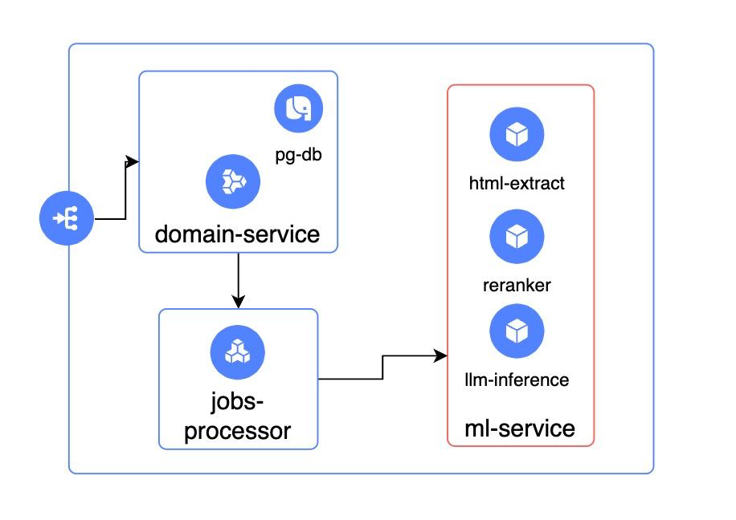

# О проекте

# Как развернуть проект
Чтобы протестировать локально, достаточно загрузить модель и запустить

Загрузка модели
```bash
wget https://huggingface.co/NousResearch/Meta-Llama-3-8B-Instruct-GGUF/resolve/main/Meta-Llama-3-8B-Instruct-Q4_K_M.gguf ./app/models
```

``make up``

Теперь приложение доступно по адресу http://localhost:80/

### Архитектура решения



### Технологии

Backend
- Python
- FastApi
- Celery
- Graphql

Frontend
- React
- Typescript
- shadcn/ui
- react-query

Devops
- Docker
- Terraform
- Yandex.Cloud


### Фичи решения

#### Плагин

Чтобы установить плагин: загрузите его из https://github.com/banzai-team/geekbrains-plan/releases/download/v0.0.1/dist.zip
и установите в соответствующий браузер.

#### Веб-приложение

В веб приложении можно загрузить вакансию как через ссылку, так и через pdf файл.

# Реализованные ML подходы

Детальная информация о реализованных подходах находится [тут](./ml/readme.md)